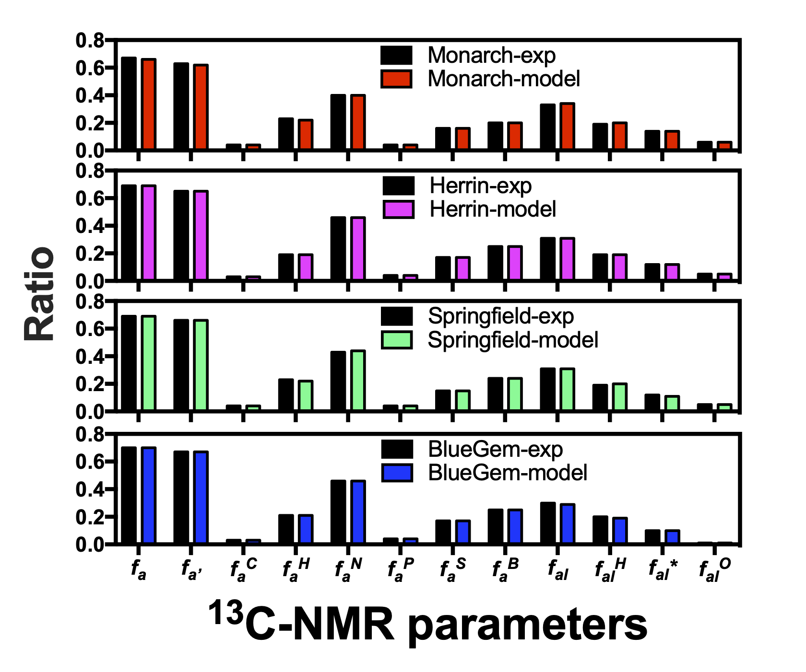
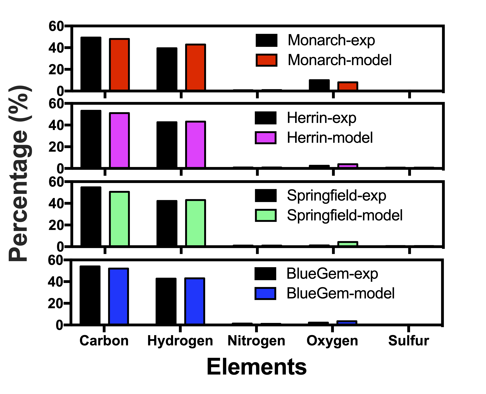
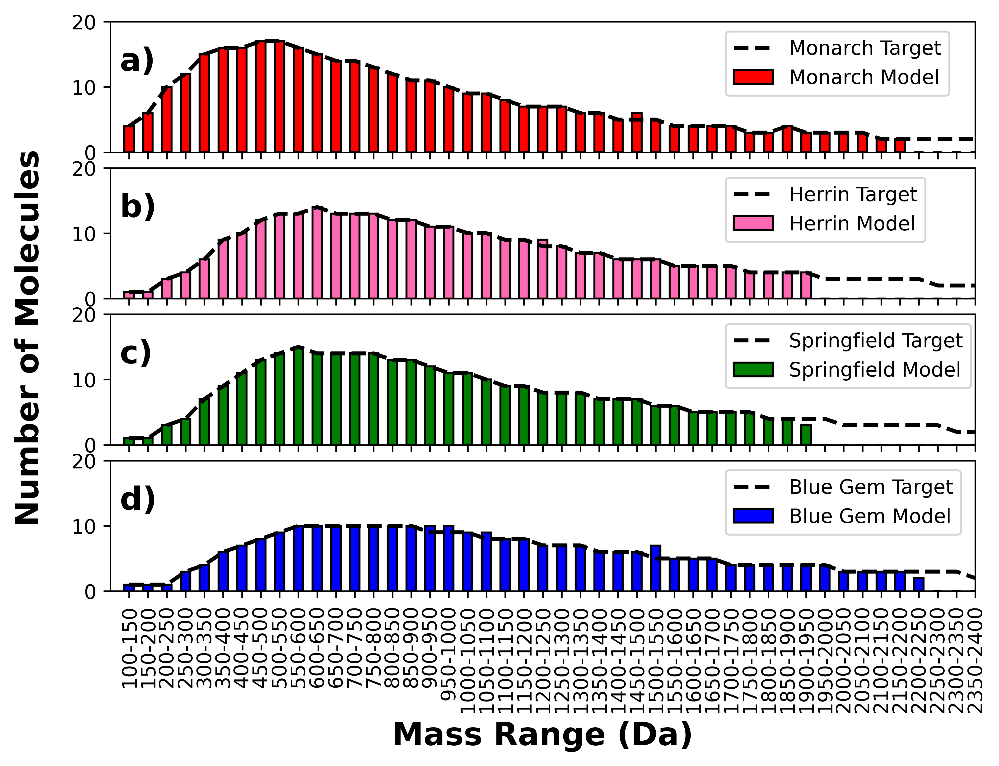
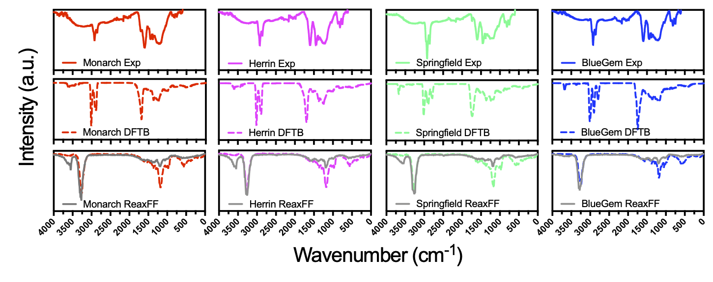

# Molecular Coal Structure Database for Monarch,Herrin,Springfield and Blue Gem

## Coal molecular database contructed from molecularsolidbuilder with four coal samples

This repository contains the molecular structures generated from the MolecularSolidBuilder tool (https://github.com/MoleCraftHUB/MolecularSolidBuilder).

